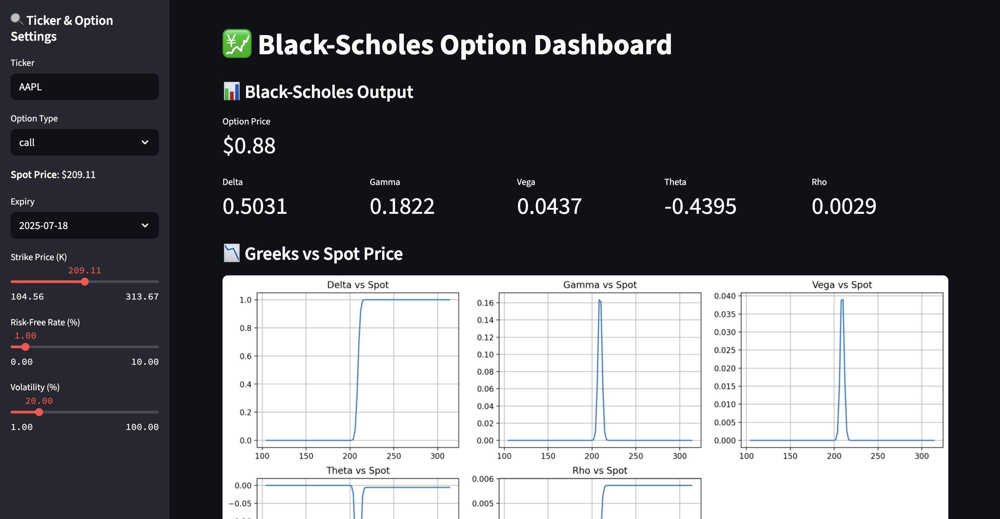

---

## 💡 Features

- ✅ Black-Scholes pricing for European calls and puts  
- ✅ Full calculation of Greeks: Δ, Γ, ν, Θ, ρ  
- ✅ Real options chain fetching & cleaning (Yahoo Finance)  
- ✅ Implied volatility surface visualization  
- ✅ Interactive Greek analysis with line plots  
- ✅ Modular architecture (easy to extend)

---

## 🛠 Tech Stack

- Python 3.9+
- `scipy`, `pandas`, `matplotlib`
- Yahoo Finance API (`yfinance`)
- Modular OOP-style architecture
- Clean, reproducible code

---

---

## 👋 About Me

https://github.com/benkier0
